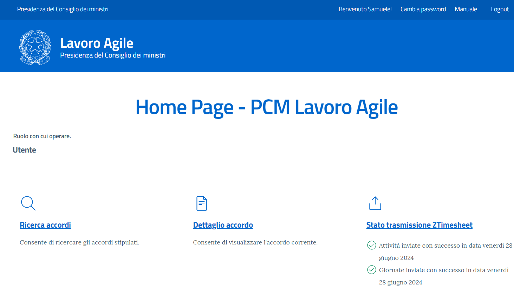

# Lavoro Agile



## Introduzione
Lavoro Agile è una applicazione che consente di gestire gli accordi di lavoro agile per un'amministrazione pubblica.

L'implementazione è aderente a quanto previsto dal Decreto Legge 31 dicembre 2020, n. 183 e s.m.i.

L'applicazione si integra con:
* il motore di Workflow open source [Elsa](https://elsa-workflows.github.io/elsa-core/), su cui girano i workflow di approvazione degli accordi
* Zucchetti, da cui recupera attraverso un report custom l'anagrafica utenti
* ZTimesheet, a cui invia le informazioni su attività e giornate di smart working
* Ministero del Lavoro, cui vengono inviate informazioni sull'accordo di lavoro agile utili alle azioni di controllo
* Server di email per inviare le notifiche
* Server LDAP per autenticare gli utenti in una installazione Intranet

L'integrazione con Zucchetti è disattivabile ed al suo posto è possibile attivare la modalità che consente di recuperare le informazioni sulle strutture direttamente dalla base dati, previo censimento delle stesse da parte dell'amministratore.

Tutte le interazioni in uscita (ZTimesheet, Ministero,  Mail) sono mediate da un sistema di code.

A corredo dell'applicazione, sono presenti due applicazioni che consentono di definire workflow e di monitorare lo stato della coda e dei workflow.

## Sommario

- [Documentazione](#documentazione)
- [Funzionalità](#funzionalità)
- [Roadmap](#roadmap)

## Documentazione

Per una guida completa all'architettura ed ai flussi, fare riferimento alla documentazione di progetto

## Funzionalità

L'applicativo prevede cinque tipologie di utenti, ognuno con proprie funzionalità specifiche. Di seguito si riportano i nomi delle figure previste e le principali funzionalità ad esse associate.

- L'_Amministratore_, identificato dal ruolo _Administrator_, può:
  - Creare utenze associandogli eventualmente il ruolo di amministratore
  - Creare strutture. Nel caso in cui sia attiva l'integrazione con Zucchetti, sarà possibile solamente creare strutture di primo livello ed associare alle stesse il referente interno; nel caso in cui sia attiva la modalità _struttura su database_, sarà anche possibile censire gli altri due livelli, nonché impostare le informazioni sui responsabili di ogni livello.
  - Gestire i componenti della segreteria tecnica
  - Attuare delle remediation sugli accordi (riportarli in uno stato precedente, eliminarli, eliminarne la valutazione, ...)

- Il componente della _Segreteria Tecnica_, identificato da un utente che è stato censito dall'amministratore come componente della Segreteria tecnica, può:
  - Ricercare accordi per tutti i dipendenti dell'amministrazione
  - Intervenire nel flusso di valutazione dell'accordo attraverso l'inserimento di note al dipendente
  - Consultare un cruscotto di monitoraggio che consente di ottenere delle statistiche sui dati presenti in piattaforma (ad esempio numero di accordi attivi, media delle giornate di lavoro agile per accordo, ...) 

- Il _Referente interno_, identificato da un utente che è stato impostato come referente tecnico per almeno una stuttura, può ricercare accordi per le strutture cui è assegnato. Lo scopo di questo ruolo è quello di poter supportare i dipendenti nelle fasi di definizione, sottoscrizione e valutazione dell'accordo 

- Il _Responsabile dell'accordo_, identificato da un utente che è stato impostato come responsabile dell'accordo per almeno una struttura, può:
  - Ricercare accordi trasmessi dai suoi sottoposti
  - Approvare, rifiutare e chiedere integrazioni per un accordo trasmesso da un sottoposto
  - Valutare un accordo trasmesso da un sottoposto

- L'_utente_, ovvero un qualsiasi utente dell'applicativo. E' importante notare che tutte le figure sopra riportate sono riconosciuti anche come utenti. Accedendo quindi all'applicativo, anche le altre figure saranno in grado di effettuare le operazioni riservate ad un utente normale:
  - Definire e sottoscrivere un accordo di lavoro agile
  - Ricercare i propri accordi
  - Visualizzare i dettagli dei propri accordi precedenti
  - Visualizzare i dettagli dell'accordo in essere
  - Recedere da un accordo
  - Inviare richiesta di rinnovo per un accordo in corso
  - Inviare richiesta di revisione per un accordo in corso
  - Visualizzare lo storico delle fasi attraversate da un accordo
  - Navigare nella storia degli accordi
  - Compilare l'auto valutazione da poter inviare in approvazione al proprio responsabile

## Roadmap

Le seguenti funzionalità sono pianificate per le prossime release di Lavoro Agile:

- [ ] Possibilità di chiedere il reset della password
- [ ] Possibilità di impostare una password per i componenti della segreteria tecnica
- [ ] Aggiornamento della versione del motore di Workflow Elsa
- [ ] Possibilità di utilizzare un workflow gestito da codice invece che dalla libreria di workflow Elsa
- [ ] Possibilità di personalizzare il nome dell'amministrazione editando il file di configurazione
- [ ] Revisione dell'interfaccia utente per migliorarne la UX
- [ ] Aggiunta del supporto per inviare Email tramite le API di Graph

## Come contribuire
I contribuiti atti al miglioramento del software sono sempre i benvenuti. Di seguito le regole per poter contribuire:

### 1. Fork and Clone del repository
Per inziare, è necessario creare un fork del repository verso il proprio account GitHub. Per creare un fork, dalla pagina iniziale del repository, cliccare sul pulsante "Fork" nella barra di comando in alto. Una volta creato il fork, si potrà procedere con il clone del repository nella propria macchina attraverso il comando:
 
```bash
git clone https://github.com/YOUR_USERNAME/lavoro-agile.git
```
Sostituire `YOUR_USERNAME` con la propria username GitHub. Per ulteriori informazioni su come effettuare un fork, consultare la documentazione ufficiale GitHub [qui](https://docs.github.com/en/github/getting-started-with-github/fork-a-repo).

### 2. Aprire `PCM-LavoroAgile.sln` utilizzando l'IDE preferito
Aprire la cartella in cui è stato clonato il repository e quindi aprire il file di solution `PCM-LavoroAgile.sln` con l'IDE preferito. L'importante è che l'IDE supporti lo sviluppo `.NET 8`. E' possibile ad esempio utilizzare Visual Studio, JetBrains Rider, o Visual Studio Code con le appropriate estensioni.

Aprendo la soluzione nella cartella `src` saranno presenti tre applicazioni web:
- `PCM-LavoroAgile`, l'applicazione principale che consente di avviare il sistema di gestione degli accordi di lavoro agile
- `PCM-MonitoringDashboard`, l'applicazione che consente di avviare la dasboard di monitoraggio dei workflow e delle code
- `PCM-WorkflowDefinition`, l'applicazione che consente di definire workflow da eseguire sul motore di workflow Elsa (fare riferimento alla documentazione per informazioni su come pubblicare nuovi flussi o aggiornamenti al flusso di approvazione)

Le web app sono configurate per facilitare al massimo lo sviluppo, quindi non dipendono da software installato su macchine diverse da quella su cui si vuole sviluppare ed utilizzano istanze locali, eventualmente dockerizzate, di SQLServer e del server Mail. Inoltre l'app principale (`PCM-LavoroAgile`) è configurata con l'integrazione Zucchetti spenta e per utilizzare le strutture prelevate dal database.

Per SQLServer ed il server di mail, il consiglio è di installarsi `Docker Desktop` o `Podman Desktop` ed istanziarsi due container a partire dalle immagini di:
- `rnwood/smtp4dev`, un server e-mail fake
- `mcr.microsoft.com/mssql/server`, la versione contenerizzata ufficiale Microsoft, di SQLServer nella versione 2022

Se si utilizza Visual Studio e si seleziona il profilo di esecuzione IIS Express, le app sono configurate:
- `PCM-LavoroAgile` per rispondere alla url `https://localhost:44380/`
- `PCM-MonitoringDashboard` per rispondere alla url `https://localhost:44318/`
- `PCM-WorkflowDefinition` per rispondere alla url `https://localhost:44304/`

Se si utilizza una configurazione diversa da quella fin qui descritta, prima di avviare per la prima volta le applicazioni è necessario effettuare alcune modifiche nei file di configurazione.

Per l'applicazione principale (`PCM-LavoroAgile`), bisogna agire sul file `appsettings.json/appsettings.Development.json` di questo progetto (di cui si trova una descrizione completa nella documentazione di progetto). Sono da modificare:
- Le connessioni al database, presenti nelle chiavi di configurazione `ConnectionStrings:DefaultConnection` e `ConnectionStrings:CAPConnection`, che dovranno essere modificate per puntare al proprio database server (Lavoro Agile utilizza SQLServer, ma si è liberi di utilizzare qualunque database supportato da Entity Framework modificando il codice di configurazione del database provider presente nel metodo `AddDbContext` del file di estensione `StartupExtensions`)
- `MailSettings`, da configure con le coordinate del server si posta elettronica
- `AllowedOrigins`, da modificare con la base url dell'app di monitoring (`PCM-MonitoringDashboard`)
- `Elsa:Server:BaseUrl`, da modificare con la base url dell'app principale (`PCM-LavoroAgile`)

Ci sono poi tre configurazioni che possono essere utili:
- `StruttureService`, il cui valore può essere sostituito con `Infrastructure.Services.ZucchettiStruttureService, Infrastructure` se si vuole utilizzare l'integrazione con i servizi di Zucchetti (molto probabilmente sarà necessario prima adattare il connettore per farlo funzionare con la propria istanza Zucchetti in quanto i servizi di recupero dell'anagrafica e delle giornate di smart working sono servizi custom definiti su Zucchetti)
- `MigrationJobEnabled`, che consente di abilitare il job che inizializza il database al primo avvio dell'applicazione. Se si preferisce eseguire la preparazione del database in autonomia (ad esempio perché non si hanno i permessi di admin sul database), mettere questa chiave a false ed eseguire in qualsiasi ordine gli script presenti nella folder scripts (sono script idempotenti quindi non è un problema se dovessero essere accidentalmente eseguiti più volte)
- `AdminUser`, che contiene username e password dell'utente Admin creato dal sistema durante la prima esecuzione o dagli script se si è preferito inizializzare il database a mano. Username e password riportati in questa configurazione serviranno per accedere all'applicazione la prima volta.

Per quanto riguarda invece l'applicazione `PCM-MonitoringDashboard`, prima di avviarla per la prima volta, è necessario dare un'occhiata al file `appsettings.json/appsettings.Development.json` ed in particolare controllare ed eventualmente modificare le chiavi:
- `ConnectionStrings:CAPConnection`, da modificare per far puntare l'app al proprio database
- `Elsa:Server:BaseAddress`, per impostare la base url dell'app principale (`PCM-LavoroAgile`).

Per evitare l'accidentale push di credenziali o informazioni sensibili, si consiglia di non inserire queste informazioni direttamente nei file di config ma di utilizzare il `Secret Manager` di .NET. E' possibile accedere al manager:
- Da Visual Studio con il tasto destro del mouse sul progetto e quindi cliccando su `Manage User Secrets`
- Da linea di comando. In questo caso per prima cosa è necessario aprire un prompt, posizionarsi nella cartella dell'app da configurare e quindi inizializzare il manager con il comando `dotnet user-secrets init` e quindi aggiungere voci con il comando `dotnet user-secrets set "Chiave:Sottochiave" "Valore"`. 

E' possibile trovare maggiori informazioni sul `Secret Manager` [qui](https://learn.microsoft.com/en-us/aspnet/core/security/app-secrets?view=aspnetcore-8.0&tabs=windows).

Consultare la documentazione di progetto per ottenere informazioni su come partire con una nuova installazione.

Se si apportano modifiche ad almeno uno dei `context`, è necessario generare i file di `migration` ed aggiornare i file sql presenti nella cartella `scripts`.

L'applicazione si compone di tre `context`:
- `IdentityContext`, dedicato alla parte di identity
- `StrutturaContext`, dedicato alla parte di gestione delle strutture
- `AccordoContext`, dedicato alla parte di gestione degli accordi

Visual Studio rende semplici e supportate da GUI le operazioni di compilazione, generazione dei pacchetti di rilascio e generazione dei file di migrazione. Nel caso in cui si voglia procedere con la `.NET 8 command line interface`, di seguito si riportano le indicazioni per compilare le tre applicazioni.

1. Posizionarsi nella cartella dell'applicazione da compilare / rilasciare
2. Compilare eseguendo il comando `dotnet build --runtime win-x64`. Consultare la documentazione riportata [qui](https://learn.microsoft.com/en-us/dotnet/core/tools/dotnet-build) per maggiori informazioni sul comando di `build`.
3. Creare il pacchetto eseguendo il comando `dotnet publish --output 'build' --self-contained true --runtime win-x64`. Consultare la documentazione riportata [qui](https://learn.microsoft.com/en-us/dotnet/core/tools/https://learn.microsoft.com/en-us/dotnet/core/tools/dotnet-publish) per maggiori informazioni sul comando di `publish`.

Nei comandi:
- `--self-contained` valorizzato a `true`, consente di inglobare nel pacchetto i `runtime` del framework: può essere omesso se si vuole che l'applicazione utilizzi la framework installata a sistema. In questo caso sarà preventivamente necessario installare sulla macchina il runtime di .NET scaricabile da [qui](https://dotnet.microsoft.com/it-it/download/dotnet/8.0) (si precisa a tal proposito che la framework core è multipiattaforma e di conseguenza potrà essere installata su Windows, macOS e Linux). 
- `--runtime` specifica il runtime da "includere" nel pacchetto (negli esempi `win-x64` includerà il runtime per Windows 64 bit, [qui](https://learn.microsoft.com/en-us/dotnet/core/rid-catalog) è possibile consultare l'elenco dei `runtime identifier` utilizzabili).

Il pacchetto generato dal comando di `publish` è quello che deve essere pubblicato sull'`application server` di riferimento. Fare riferimento alla documentazione ufficiale dell'application server per ottenere informazioni sull'installazione di un'applicazione `.NET Core 8`.

Le migrazioni vanno eseguite posizionandosi nella cartella dell'app principale (`PCM-LavoroAgile`).
La prima volta che si vuole generare una migrazione, è necessario fare il restore del tool lanciando il comando

```bash
dotnet tool restore
```

Questo installerà la versione `8.0.6` del tool `dotnet-ef`.

La tabella seguente riporta, per ogni `context` i comandi da lanciare per generare il nuovo file migrazione ed aggiornare il file di script.

| Context          | Migration                                                                                      | Script                                                                                                   |
|------------------|------------------------------------------------------------------------------------------------|----------------------------------------------------------------------------------------------------------|
| IdentityContext  | `dotnet ef migrations add XXXX --context identitycontext --output-dir 'Migrations/Identity'`   | `dotnet ef migrations script --context identitycontext --idempotent --output ..\..\scripts\identity.sql`   |
| StrutturaContext | `dotnet ef migrations add XXXX --context strutturacontext --output-dir 'Migrations/Struttura'` | `dotnet ef migrations script --context strutturacontext --idempotent --output ..\..\scripts\struttura.sql` |
| AccordoContext   | `dotnet ef migrations add XXXX --context accordocontext --output-dir 'Migrations/Accordo'`     | `dotnet ef migrations script --context accordocontext --idempotent --output ..\..\scripts\accordo.sql`     |

### 3. Sottomettere una PR con le proprie modifiche
Quando si sono completate le modifiche al codice e si è pronti per rilasciarlo, effettuare la push del codice verso il proprio fork e quindi dall'interfaccia di GitHub, effettuare una pull request verso il repository ufficiale. Cercare di fornire più informazioni possibili per aiutare i revisori nel compito di verifica del codice. Per maggiori informazioni visitare la pagina ufficiale di GitHub [Creare una pull request da un fork](https://docs.github.com/en/github/collaborating-with-issues-and-pull-requests/creating-a-pull-request-from-a-fork).